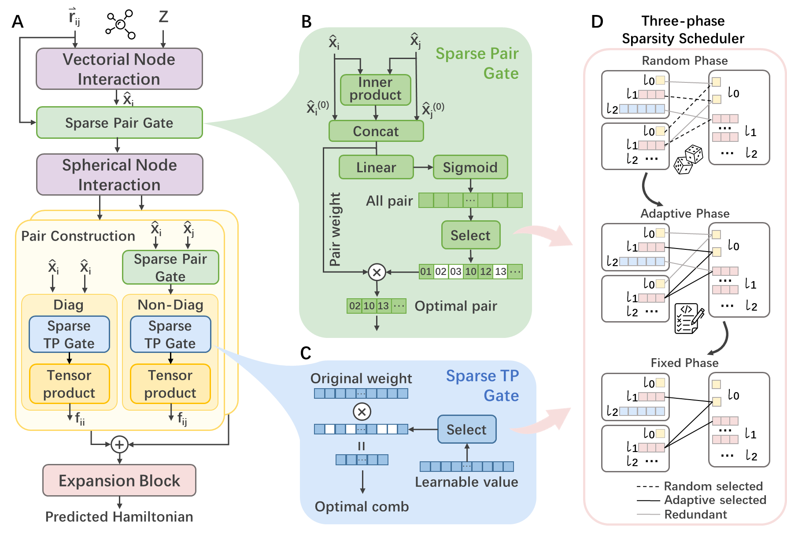

# Introduction
Welcome! This repository is the official implement of SPHNet in the ICML'25 paper: [Efficient and Scalable Density Functional Theory Hamiltonian Prediction through Adaptive Sparsity](https://arxiv.org/abs/2502.01171). 



SPHNet is an efficient and scalable equivariant network that incorporates adaptive SParsity into Hamiltonian prediction task. SPHNet employs two innovative sparse gates to selectively constrain non-critical interaction combinations, significantly reducing tensor product computations while maintaining accuracy. 


# Setup environment
## Local environment
By running the following command, you will create a virtual environment with all the necessary packages to run the code.
Note that it is better to use CUDA driver more than 520, due to the requirement of the package `CUDA Toolkit 12`.
```bash
conda env create -n sphnet -f environment_mac.yaml
conda activate sphnet
```

# Data preparation
Before training, you need to preprocess the data to our custom format to maximize model performance. 

You can generate well-formed data with below command for md17 and qh9 dataset or modify this file to preprocess your own dataset. We support original data file in both lmdb and mdb format. 
    
```bash
python src/dataset/preprocess_data.py --data_name qh9_dynamic_mol --input_path /path/to/original/QH9Dynamic --output_path /path/to/preprocessed/qh9/dynamic/data.mdb
```

For data_name we support qh9_stable/dynamic_split (such as qh9_dynamic_mol). For input_path, set the folder path where you put the QH9Dynamic/QH9Stable folder. We also provide an example data in the ./example_data folder, which is a small subset of qh9_stable_iid. You can skip the preprocess and set the dataset-path to ./example_data/data.lmdb to fast train and test model.

# Model training
## Halmintonian model train on local machine
There are three config files that set the model and training process. The config file in config/model is the model configuration. The config file in config/schedule set the learning schedule. The config/config.yaml is the overall configuration file. Please see the comments in config/config.yaml for more details.
1. Run the following command to train the model.
    ```bash
     python pipelines/train.py wandb=True wandb-group="train" data_name="qh9_stable_iid" basis="def2-svp" dataset-path="/path/to/your/data.mdb" \
    ```
    Note: To enable WALoss, please add `enable_hami_orbital_energy=True` to the command.
    
    Specifically, when running QH9 dataset, we support four kinds of data_name: "qh9_stable_iid","qh9_stable_ood","qh9_dynamic_mol", and "qh9_dynamic_geo". The basis should set to "def2-svp". When running PubChemQH dataset, set the data_name to "pubchem" and the basis to "def2-tzvp". In the mean time, you should modify to model config file to suit different basis and dataset (Please see the comments in config/model/sphnet.yaml for detail).
2. Run the following command to test the model.
    ```bash
     python pipelines/test.py wandb=True wandb-group="test" data_name="qh9_stable_iid" basis="def2-svp" dataset_path="/path/to/your/data.mdb" 
    ```


# Citation

```
@article{sphnet,
  title={Efficient and Scalable Density Functional Theory Hamiltonian Prediction through Adaptive Sparsity},
  author={Luo, Erpai and Wei, Xinran and Huang, Lin and Li, Yunyang and Yang, Han and Xia, Zaishuo and Wang, Zun and Liu, Chang and Shao, Bin and Zhang, Jia},
  journal={arXiv preprint arXiv:2502.01171},
  year={2025}
}
```